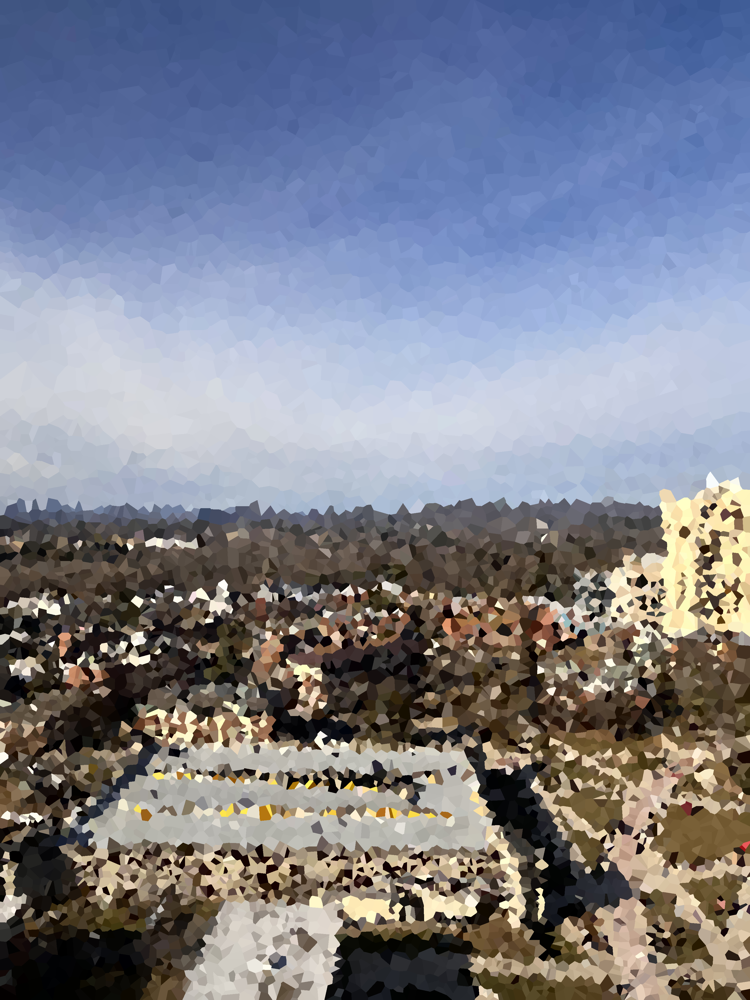

# ImageMosaicConverter
Converts an image to a mosaic style art image.

  
  

## Instructions
1. Upload your image to the same directory as the main.py file
2. In the main.py file set the image_path variable to the name of your image. Ex: 'Meme.jpg'
3. Set the save_name variable to the name of your image after converting to a mosaic. Ex: 'MemeMosaic.jpg'
4. Set the mosaic_nodes variable to the number of nodes in the mosaic. Ex: 5000
5. Run python main.py in the same directory in the terminal

  
  

## Node Number
- Generally the higher the node number, the more detailed the mosaic image.
- The node number does not scale with the size of the image, so the resolution of the image should factor how you choose the number of nodes.
- The more the nodes and the higher the resolution, the longer it takes to run.
